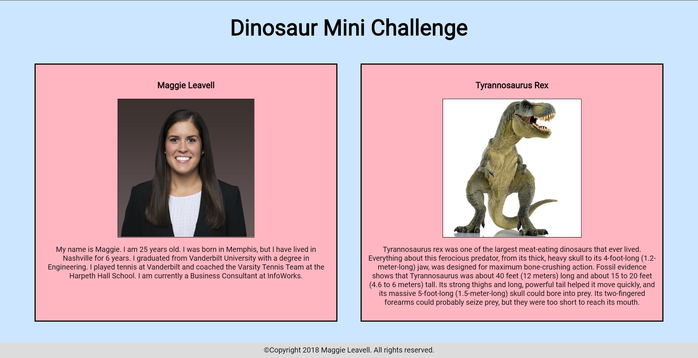

# Dinosaur Mini Challenge

## Description
Create a site for your favorite dinosaur. Write clean code - consistent spacing, appropriate tabbing, etc. Use git git branches, and github. You should have a fresh branch for each of the following features:
* As a user, when I go to your site I should see your favorite color set to the background, and I should see a footer with your name and date.
* As a user, when I go to your site I should see a card with a picture of you and a paragraph about you, and this card should take up half the width of the screen
* As a user, when I go to your site I should see a card with a picture of your favorite type of dinosaur and a paragraph of why its your favorite dinosaur, and this card should take up half the width of the screen

## Screenshots


## How to run this project
* Use npm to install http-server in your terminal:
```sh
npm install -g http-server
```
* Run the server in your terminal
```sh
hs -p 9999
```
* Open chrome and navigate to:
```
localhost:9999
```
## Contributors
[Maggie Leavell](https://github.com/mjleavell)